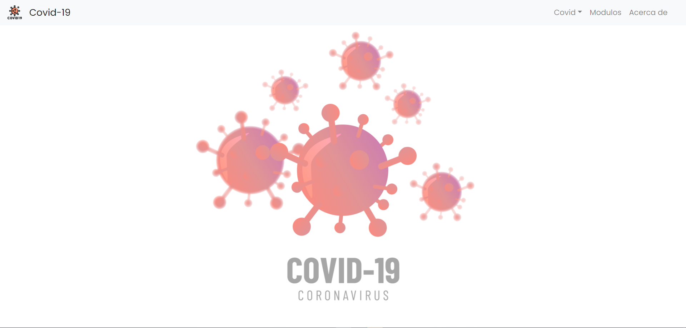
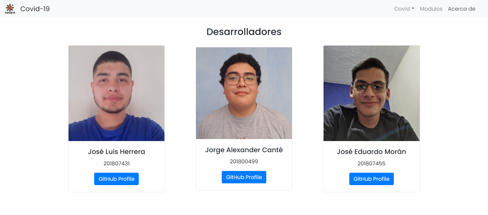
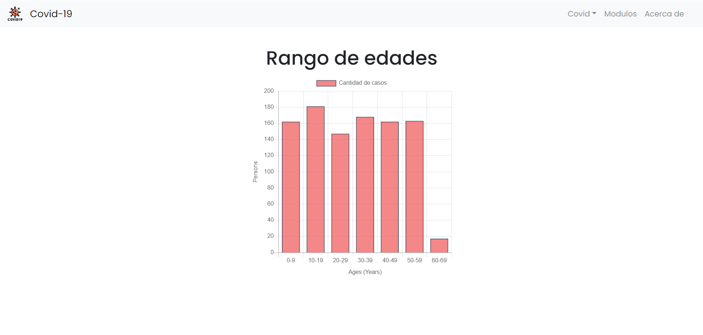
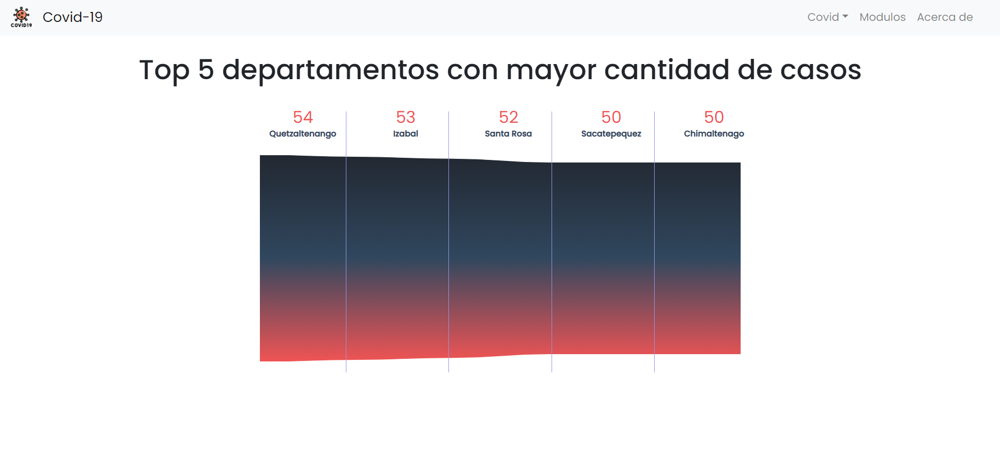
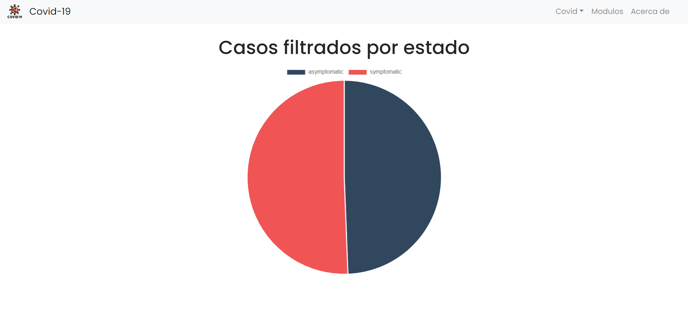
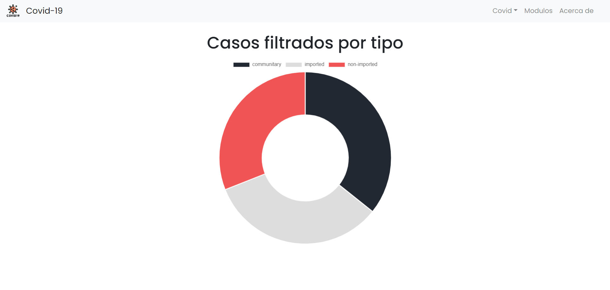
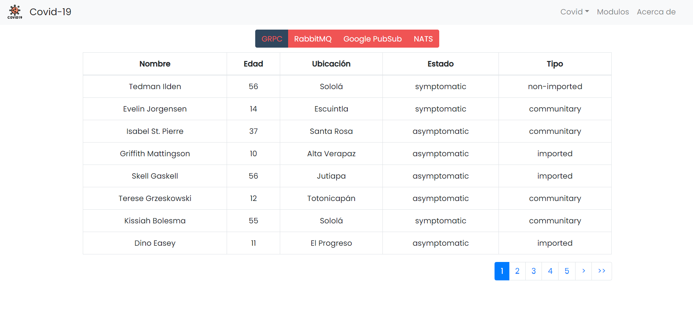
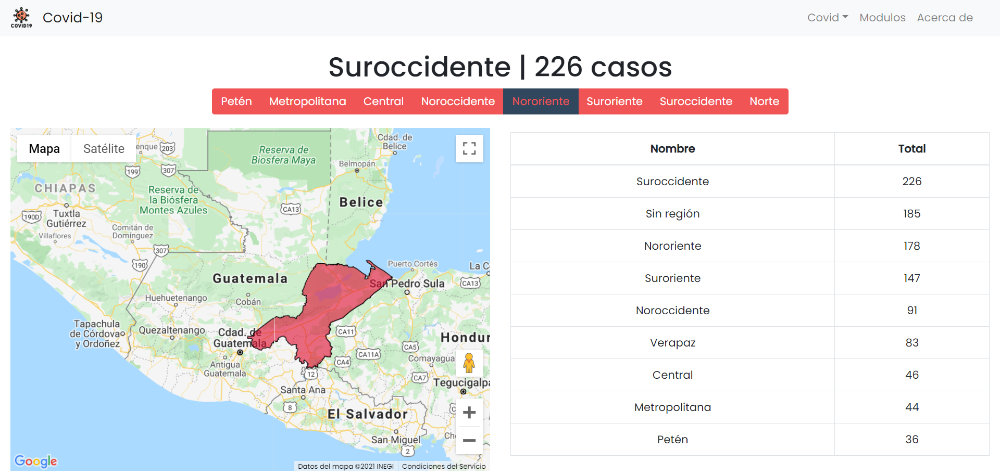
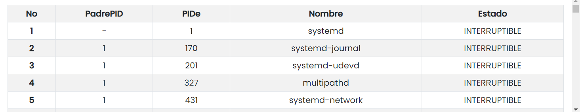
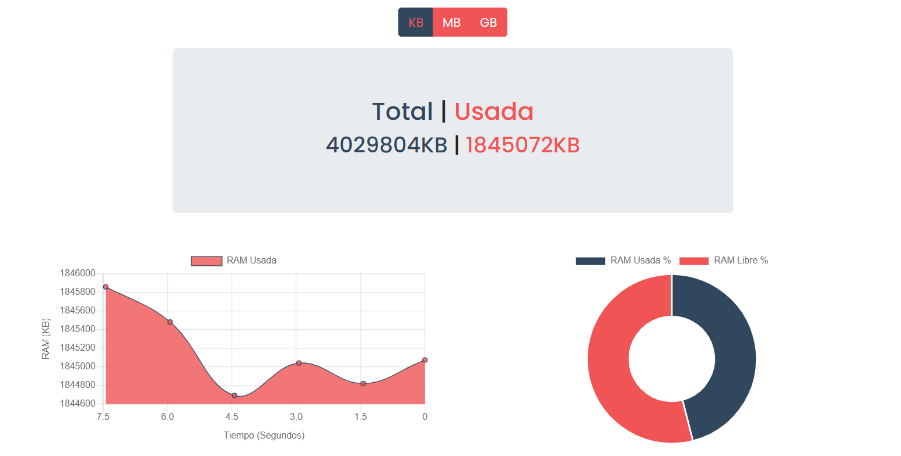

## Contenido
- [Covid-App](#covid-app)
  * [Manual Técnico](#manual-técnico)
    + [Componentes](#componentes)
      - [Home](#home)
      - [About](#about)
      - [Modules Data](#modules-data)
      - [RAM Cake](#ram-cake)
      - [RAM Line](#ram-line)
      - [Process Table](#process-table)
      - [Age Bar](#age-bar)
      - [Infection Type Cake](#infection-type-cake)
      - [Top Funnel](#top-funnel)
      - [State Pie](#state-pie)
      - [Last Data](#last-data)
      - [Way Data](#way-data)
      - [Region](#region)
    + [Dockerfile](#dockerfile)
  * [Manual de usuario](#manual-de-usuario)
    + [Uso de manera local](#uso-de-manera-local)
      - [Usando NodeJS](#usando-nodejs)
      - [Usando Docker](#usando-docker)
    + [Registrar la imagen en Google Container Registry](#registrar-la-imagen-en-google-container-registry)
    + [Capturas](#capturas)

# Covid-App
Una aplicación hecha en ReactJS, usando tanto su implementación a través de funciones y clases

## Manual Técnico
### Componentes
#### Home
```js
func Home() 
```
Se encarga únicamente de ser la página de inicio de la aplicación
#### About
```js
function About()
```
Brinda información acerca de los autores del proyecto entero de **Covid-App Cloud**
#### Modules Data
```js
function Modules()
```
Se encarga de mostrar y constantemente solicitar información acerca de la memoria RAM como de los procesos que se realizan en el servidor donde se alojan los registros
#### RAM Cake
```js
function RamCake(props)
```
Se encarga de mostrar los porcentajes de la memoria RAM en tiempo real en el servidor donde se alojan los registros
#### RAM Line
```js
class RamLine extends Component
```
Se encarga de mostrar la cantidad de la memoria RAM en tiempo real usada en el servidor donde se alojan los registros 
#### Process Table
```js
function Proc()
```
Se encarga de mostrar en tiempo todos los procesos del servidor donde se alojan los registros
#### Age Bar
```js
function BarGraph()
```
Se encarga de mostrar en una gráfica de barras, el número de registros en base a un rango de edad de los infectados

#### Infection Type Cake
```js
function CakeGraph()
```
Se encarga de mostrar en una gráfica de pastel, el número de registros en base a la forma en que se contagiaron los infectados
#### Top Funnel
```js
class FunnelG extends Component
```
Se encarga de mostrar en una gráfica de Funnel, los departamentos donde más personas se han contagiado con su respectivo número de registros
#### State Pie
```js
function PieGraph()
```
Se encarga de mostrar en una gráfica de pie, el número de registros en base al estado del infectado
#### Last Data
```js
class LastData extends Component
```
Se encarga de mostrar en una tabla, los ultimos 5 registros de infectados en ser almacenados
#### Way Data
```js
class FilterData extends Component
```
Se encarga de mostrar en una tabla, los registros en base al Middleware que se uso para que ingresase a la base de datos
#### Region
```js
class Region extends Component
```
Se encarga de mostrar la información completa de los datos según la región donde se registraron, además de dar la posibilidad de saber en específico la situación de una región de la elección del usuario, coloreando además la región seleccionada
### Dockerfile
Debido a la necesidad de mantener nuestra página en línea se opto por mantenerla en un servicio de Google Run, para lo cual necesitamos poder generar una imagen de Docker de la misma, por lo que debemos de usar un contenedor de NodeJS(React) para realizar la distribución de producción pero ya que la página creada es imposible de mantenerse en línea de manera independiente, se debe de implementar un servicio dentro de un contenedor que sea capaz de mantenerla en linea como Nginx en este caso.
```Dockerfile
# build environment
FROM node:alpine as react-build
WORKDIR /app
COPY . ./
RUN yarn
RUN yarn build

# server environment
FROM nginx:alpine
COPY nginx.conf /etc/nginx/conf.d/configfile.template

COPY --from=react-build /app/build /usr/share/nginx/html

ENV PORT 8080
ENV HOST 0.0.0.0
EXPOSE 8080
CMD sh -c "envsubst '\$PORT' < /etc/nginx/conf.d/configfile.template > /etc/nginx/conf.d/default.conf && nginx -g 'daemon off;'"
```
Además debemos de agregar un archivo de configuración para Nginx, para que sea capaz de mantener en línea, nuestra página de React.
```conf
server {
     listen       $PORT;
     server_name  localhost;

     location / {
         root   /usr/share/nginx/html;
         index  index.html index.htm;
         try_files $uri /index.html;
     }

     gzip on;
     gzip_vary on;
     gzip_min_length 10240;
     gzip_proxied expired no-cache no-store private auth;
     gzip_types text/plain text/css text/xml text/javascript application/x-javascript application/xml;
     gzip_disable "MSIE [1-6]\.";

}
```
## Manual de usuario
### Uso de manera local
#### Usando NodeJS
Primero, se debe de instalar completamente los paquetes necesarios para ejecutar React:
- Usando NPM:
```bash
npm install
```
- Usando Yarn:
```bash
yarn
```
Si deseamos visualizar la distribución de desarrollo:
- Usando NPM:
```bash
npm start
```
- Usando Yarn:
```bash
yarn start
```
Si deseamos generar la distribución de producción:
- Usando NPM:
```bash
npm run build
```
- Usando Yarn:
```bash
yarn build
```
#### Usando Docker
Primero, construimos la imagen para poder correr nuestra página local
```bash
docker build --t covid-app /.
```
Luego corremos una instancia de esta imagen generada:
```bash
docker run -p 8080:8080 covid-app
```
### Registrar la imagen en Google Container Registry
Para poder realizar este proceso debemos de tener una cuenta de Google Cloud, tener instalado GCloud SDK ([¿Cómo instalar?](https://cloud.google.com/sdk/docs/install)) y tener activas las APIs de GCloud([Activar APIs](http://console.cloud.google.com/apis/library)): *Cloud Run API, Google Container Registry API y Cloud Build API*

Al tener todo lo anterior debemos de ejecutar, sustituyendo **[YOUR_PROJECT_ID]** por la id de tu proyecto:
```bash
gcloud builds submit --tag gcr.io/[YOUR_PROJECT_ID]/covid-app
```
Luego de esto, nuestra imagen de Docker estará en línea para poder ser usada en cualquier sevicio. Finalmente podemos crear un servicio de Google Run desde la consola de GCloud.

### Capturas
Home

About

Age Bar

Top Funnel

State Pie

Infection Type Cake

Last Data

Way Data

Region

Process Table

RAM Cake & Line
